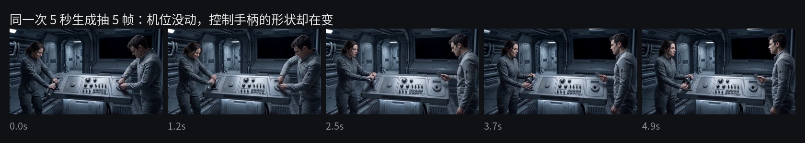

# Passenger Zero · AI 短片连戏检查器

**给 AI 生成的短片当场记——查那些单帧看不出来的错。**

*A continuity checker for AI-generated short films. It catches the errors you cannot see in a single frame. Chinese docs below; the tool runs offline with no API keys.*



上面是同一次 5 秒生成里按时间顺序抽的 5 帧。**机位没动，两个人的站位没动——但控制手柄的形状一直在变。**

单看任何一帧，画面都完全合理。这类错误挑不出来，因为它不存在于任何一帧里，只存在于帧与帧之间。

---

## 它在你的流程里的位置

| | 做什么 | 在哪做 |
|---|---|---|
| ① | 一句话 → 分镜、每镜 prompt、**一份连戏规则** | 本工具「做分镜」页 |
| ② | 拿 prompt 去生成视频 | **即梦／可灵／Seedance 等，不在本工具里** |
| ③ | 把生成结果传回来，用①那份规则检查 | 本工具「检查素材」页 |

**①和③是同一份规则的两头。** 做分镜那一步除了给你分镜和 prompt，还会产出一份
`canon_draft.json`——它会挂进你这次会话，第③步就拿它去对。换句话说，检查用的不是一套
通用标准，而是**你自己刚定下的那个空间长什么样**。

已经有素材的话直接从③开始，那会用《第零号乘客》的成片规则当例子。

第②步刻意不在本工具里：这是一个验证器，不是生成器。

## 这是什么

拍电影有个岗位叫**场记**，专门盯「上一镜和这一镜对不对得上」——杯子在左手还是右手，钥匙插在哪儿，灯是不是亮的。

AI 生成短片没有这个岗位。而循环、闪回、多时间线的片子，同一个空间要反复拍很多次，每一次都是独立的生成调用，谁也不记得上一次长什么样。

本工具把**人工锁定的剧情事实**编译成逐镜头的检查项，让跨镜头的一致性可以被机械验证。

## 输出的不是分数，是四档决策

界面上说人话，代号只出现在折叠起来的「详细报告」里。

| 界面显示 | 内部代号 | 含义 |
|---|---|---|
| ✅ 看起来没问题 | `PASS` | 本次可观察范围内没有问题 |
| 🔧 后期能修，不用重拍 | `LOCAL FIX` | 后期能擦掉，**不必重做整镜** |
| 🔁 这条得重新生成 | `REGENERATE` | 结构性错误，必须重新生成 |
| 🤔 我不确定，你自己看一眼 | `HUMAN REVIEW` | 涉及表演或低置信度，机器不下结论 |

`LOCAL FIX` 这一档是省钱的关键。某次生成凭空多出一块显示屏——违规，但后期二十分钟能擦掉，人物动作、空间关系、光线全对。判 `LOCAL FIX` 意味着保住整条素材，而不是重跑一轮生成。

`HUMAN REVIEW` 同样重要。视觉模型会看错，**如果没有「我不确定」这个出口，它会自信地误判，而你三次之后就不再信任它的任何输出。**

## 每个结论都标注证据等级

这是本工具最在意的一件事：**你必须知道这个结论是怎么来的。** 界面上同样说人话——
没传素材时它会直接写「我没看过画面」，不含糊过去。

| 标签 | 含义 |
|---|---|
| `USER-REPORTED RULE TRIAGE` | 没传素材。结论是「若你所述属实，规则判定为此」，**系统没看过任何画面** |
| `RULE + PIXEL CHECK` | 有图，但只读了颜色与像素，模型没理解画面 |
| `VIDEO FRAME + RULE CHECK` | 视频已按时间顺序抽帧，语义结论仍来自你的描述 |
| `VISUAL AUDIT` | 有图且多模态模型实际查看并逐条核验 |
| `VIDEO VISUAL AUDIT` | 视频已抽帧，多模态模型跨帧核验 |

## 快速开始

**不需要任何 API Key。** 不配密钥时全功能可跑，理解与创作步骤走确定性模板并在执行轨迹上标注「本地降级」。

```bash
git clone <this repo>
cd passenger-zero-agent
pip install -r requirements.txt
python app.py
```

两个依赖是**可选**的，装不上也不影响启动：`imageio-ffmpeg`（视频抽帧，缺了就只关掉视频审查，图片审查照常）、`pillow-heif`（iPhone 的 .heic 解码）。

打开 `http://127.0.0.1:7860`，点「例子二：手柄变形 + 钥匙错位」——那就是上面那段素材，一次点击跑完整条审查链。

### 起不来的话

**`Couldn't start the app because 'http://localhost:7860/...' failed (code 503)`**

机器上设了系统代理（科学上网工具、公司网络都会设），Gradio 的本机自检被代理拦了。
`app.py` 已经会自动把回环地址加进 `NO_PROXY`；如果你用别的方式启动，手工设一次：

```powershell
$env:NO_PROXY="localhost,127.0.0.1"   # PowerShell
```

**视频功能报错 / `FileNotFoundError: [WinError 2]`**

`imageio-ffmpeg` 这个**包**装上了，但它带的 **ffmpeg 可执行文件**不在——杀毒软件会删它，
`IMAGEIO_FFMPEG_EXE` 指错路径也会。跑一下诊断：

```bash
python diagnose.py
```

它会逐项告诉你：包在不在、ffmpeg 解析到哪个路径、那个文件存不存在、真跑一次会怎样。
常见修法：`pip install --force-reinstall imageio-ffmpeg`。
**修不好也不影响图片审查**——应用会自动只关掉视频那一半。

**端口被占用**：`PORT=7870 python app.py`。
**绑 0.0.0.0 不通**：`HOST=127.0.0.1 python app.py`（只有本机能访问，本地使用没影响）。

可选，配置多模态审计：

```bash
export LLM_API_KEY=你的密钥
export LLM_MODEL=支持视觉输入的模型名
export LLM_BASE_URL=OpenAI兼容接口的/v1地址
```

## 它在真实制作里抓到了什么

这个工具是为一部 3 分 22 秒的硬科幻短片《第零号乘客》做的，不是先有工具再找场景。四件真实发生的事：

**1. 结局的地基挂在一条做不了的后期补丁上。** 因果审计报出三条 ERROR：结局的两个必答问题全都依赖一条计划加在 Shot 05 的补丁。后来发现那一镜根本没有可复用的素材，补丁做不了。**因为这个依赖被显式报了出来，结尾被重新设计**，而不是在成片里静默失效。

**2. 一个 100% 误报的自研指标，被整条删掉了。** 原本有个「循环发散度」检测，实测在「同一房间 + 固定机位」下恒定触发——而 canon 恰恰**要求**机位稳定。**这个指标在惩罚合规。** 没调阈值，直接删了：一个测错了东西的指标，调参数救不回来。

**3. 一个把人脸判成警报灯的颜色检测。** 初版红色判据把暖肤色特写、琥珀仪表灯、铜色道具全判成警报红。改成「高 R 且同时低 G 低 B」后九种画面全部正确。教训很朴素：**凭直觉写的阈值，必须拿真实画面的典型色值验证。**

**4. 单帧永远看不出来的错。** 就是本页顶部那张图——控制手柄的形状在一次生成内部自己变了。这催生了视频抽帧审查和一条新规则（控制台及其固定机械组件必须在镜头内保持几何结构稳定），判 `REGENERATE`。**这一条是被真实素材逼出来的，不是设计出来的。**

## 它不做什么

- **不生成视频。** 仓库里有一个 MiniMax Hailuo 适配器，但**默认关闭**，需要 Feature Flag + 独立密钥 + 访问码三重门。完成了真实视频 API 可行性探测，密钥、网络、端点和请求结构验证通过，但生成任务在提交阶段因账户套餐权限被拒绝，因此未产生视频，也未接入正式生成链路。脱敏记录见 [`evidence/`](evidence/)。
- 不自动剪辑、不配乐、不做视频续写。
- **不改写剧情。** canon 由人维护，应用只读。发现冲突时提示人工确认，不自动改。
- 模型路由只输出决策，不做实时派发。

## 已知限制

写在这里而不是藏起来，完整版见 [`scoring_gap.md`](scoring_gap.md)：

- **canon 需要人工维护。** 这是精度的来源，也是上手门槛——目前对陌生项目不够友好
- CREATE 模式产出的 canon 是骨架，规则密度低于手写
- identity 一致性**没有量化 grounding**，判据是规则 + 多模态核验，颜色只是弱先验。我们选择把这个缺口写清楚，而不是塞一个跑不准的相似度数字冒充「grounded evaluation」
- 生产日志是单进程共享 CSV，无多用户隔离（公开部署默认不展示，见下）
- 未配置模型 API 时，理解与创作走确定性模板，质量明显下降

## 安全默认值

生产日志含使用者输入的 prompt、备注和文件名。公开部署默认：

- 不渲染原始日志表，只显示不含自由文本的聚合统计
- **不绑定任何会返回日志行的回调**——`refresh_log` 根本不进事件表，因此不出现在 `/gradio_api/info`。仅仅隐藏组件是不够的，Gradio 事件可以被直接调用
- `show_error` 关闭，避免 traceback 暴露容器内绝对路径

13 项双会话隔离测试保证：访客 A 提交的独特 prompt，访客 B 通过 UI 回调、聚合统计、`/config` 与 `/gradio_api/info` 都读不到。

私有部署可设 `SHOW_RAW_LOGS=1` 放开。**不要在公开空间设置它。**

## 测试

```bash
python -m unittest discover -s . -p 'test_*.py'
```

101 项，全部通过。MiniMax 与多模态失败路径全部使用 mock，**不产生任何外部请求或费用**。完整报告见 [`test_report.md`](test_report.md)。

## 部署到魔搭创空间

平台读 `README.md` 开头的 YAML front-matter 作为配置。GitHub 版本没有它，部署时在 README 顶部加上：

```yaml
---
title: Passenger Zero · AI 短片连戏检查器
emoji: 🎬
colorFrom: gray
colorTo: red
sdk: gradio
sdk_version: 5.50.0
app_file: app.py
pinned: false
---
```

CPU 环境即可，无 GPU 依赖。

> **一个部署坑**：`Blocks.max_file_size` 不是类属性，**只在 `demo.launch()` 里赋值**，而 `/gradio_api/upload` 会无条件读它。平台若是 import `app.py` 再自行挂载 `demo`，上传就会 500，而页面、演示按钮、不传素材的审查全都正常——症状极具迷惑性。`app.py` 在模块级补了默认值，`test_upload_works_without_launch` 锁住这条回归。

## 文档

| 文件 | 内容 |
|---|---|
| [`architecture.md`](architecture.md) | 架构、状态机、Provider 映射、费用与重试策略 |
| [`test_report.md`](test_report.md) | 101 项测试的完整报告 |
| [`scoring_gap.md`](scoring_gap.md) | 主动列出的能力缺口 |
| [`demo_script.md`](demo_script.md) | 60 秒演示脚本 |

## License

代码 [MIT](LICENSE)。`assets/examples/` 与 `docs/` 里的画面是《第零号乘客》的素材，仅作为演示本工具所检测问题的测试样本，影片版权保留。
